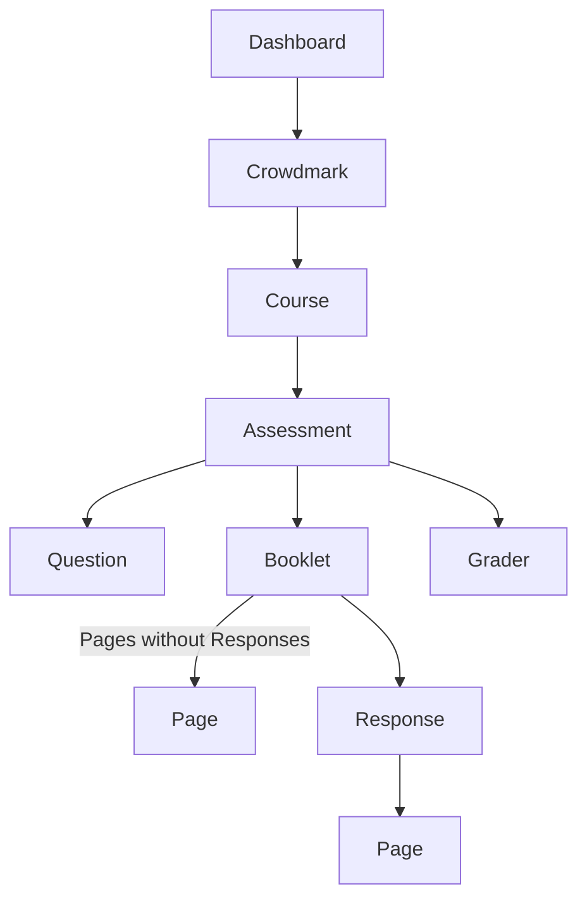

# Crowdmark Dashboard

## Instructions for Composer Package
Install this package
`composer require waterloobae/CrowdmarkDashboard`

Copy /config/API_KEY_Example.php file as API_KEY.php.
Then assign your Crowdmark API key to '$api_key` value.
```php
<?php
// change this file to API_KEY.php
namespace Waterloobae\CrowdmarkDashboard;
$api_key = "Insert your Crowdmark API key here.";
```

In your PHP file,
1. Include outoload file
   `require 'vendor/autoload.php';`
2. Define name space
   `namespace Waterloobae\CrowdmarkDashboard;`
3. Create new Dashboard object and run getForm() method.
   ```php
   use Waterloobae\CrowdmarkDashboard\Dashboard;
   $dashboard = new Dashboard();
   $dashboard->getForm()   
   ```
    
It will look like
```php
<?php
namespace Waterloobae\CrowdmarkDashboard;
require_once 'vendor/autoload.php';
use Waterloobae\CrowdmarkDashboard\Dashboard;
$dashboard = new Dashboard();
?>
<!DOCTYPE html>
<html lang="en">
<head>
    <meta charset="UTF-8">
    <title>Crowdmark Dashboard</title>
    </head>
<body>
  <?=$dashboard->getForm()?>
</body>
</html>
```

## Release Notes : version 1.00.0
API call rate limiting of 10 requests per second is enforced.

API call for responses is made for each booklet, that created around 2,500 API calls. As a result of that, it take around 30 minutes to create one Assessment. /api/responses/*response_id* is used for this.

Instead of using /api/questions/question_id/responses. Multi curls for /api/booklets/booklet_id/responses are used. It reduces response time from 30 minutes to 2 minutes.

## Crowdmark API Endpoints

**GET courses**  
`https://app.crowdmark.com/api/courses?api_key=your_api_key`

**GET one course**  
`https://app.crowdmark.com/api/courses/{course id}?api_key=your_api_key`

**GET assessments of one course**  
`https://app.crowdmark.com/api/courses/{course id}/assessments?api_key=your_api_key`

**GET one assessment**  
`https://app.crowdmark.com/api/assessments/{assessment id}?api_key=your_api_key`

**GET all booklets from assessment (paged)**  
`https://app.crowdmark.com/api/assessments/{assessment id}/booklets?api_key=your_api_key`

**GET one booklet**  
`https://app.crowdmark.com/api/booklets/{booklet id}?api_key=your_api_key`

**GET one booklet**  
`https://app.crowdmark.com/api/booklets/{booklet id}?api_key=your_api_key`

**GET responses from one booklet**  
`https://app.crowdmark.com/api/booklets/{booklet id}/responses?api_key=your_api_key`

**GET pages from one booklet**  
`https://app.crowdmark.com/api/booklets/{booklet id}/pages?api_key=your_api_key`

**GET scores from response**  
`https://app.crowdmark.com/api/responses/{response id}/scores?api_key=your_api_key`

**GET pages from response**  
`https://app.crowdmark.com/api/responses/{response id}/pages?api_key=your_api_key`

**GET one question**  
`https://app.crowdmark.com/api/questions/{question id}?api_key=your_api_key`

**GET the second page of booklets**  
`https://app.crowdmark.com/api/assessments/{assessment id}/booklets?page%5Bnumber%5D=2&api_key=your_api_key`

## Class Dependency


It is possible to get Responses from Question, however, it times out for big Assessments.

